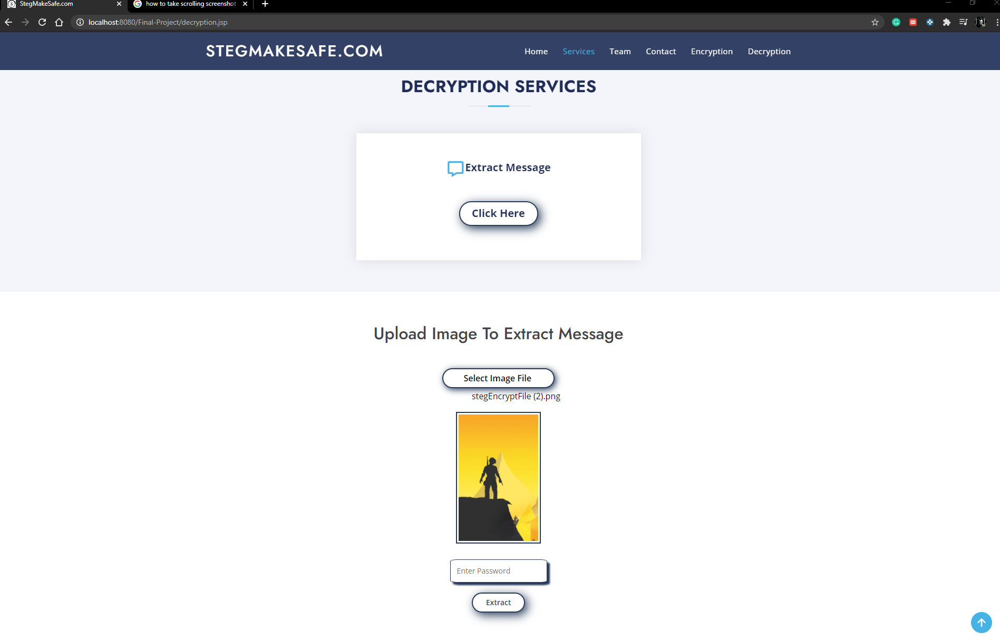

# Encryption using Steganography #
In large organizations, secrecy is of high importance, and maintaining it is a top priority. The intelligence of hackers has made this a very tedious task today. Various Encryption was previously used for sending and receiving secret information but it did not prove that secure as it gave suspicions to hackers.
 To overcome this problem, we combined ***Steganography*** and ***Cryptography***. It neither gives suspicion to hackers nor affects unintended users. It simply uses multimedia data as a medium to cover secret information that is already encrypted and can then be transmitted to desired locations.
 In this project, the information hiding is done on an image file. In this program, the user has two options i.e. Encryption and Decryption of the message. 
 --If Encryption is selected, then the user is allowed to select the image file from the local device or they have an option to select from predefined image, after selecting the image user have to write a secret message and apply password.
 --If Decryption is chosen, then they need to upload an encrypted image file along with the password set by the sender. 
Encryption is for hiding information while decryption is used for retrieving secret information. 
## About Steganography: ##
Steganography is the art of hiding the fact that communication is taking place, by hiding information in other information. Many different carrier file formats can be used, but digital images are the most popular because of their frequency on the internet. For hiding secret information in images, there exists a large variety of steganography techniques some are more complex than others and all of them have respective strong and weak points. Different applications may require absolute invisibility of the secret information, while others require a large secret message to be hidden. 
 This project deals with hiding of text behind multimedia, i.e. digital images. Cryptography cipher and password is used before hiding text to make this procedure more secure.
## Technology Used: ##
**Java**, **HTML**, **CSS**, **Servlet**, **JavaScript**, **DOM**, **jQuery**, **Bootstrap**.
# Screenshots #
<h2> Homepage </h2>

<h2> Encryption Service </h2>  

<h2> Decryption Service </h2>

<h2> Sample I/O </h2>

 
 

<h2> Advantages </h2>
➢ The main advantages of this system is Security, i.e. it provides security to your messages without knowing to third party.
 ➢ Normal network user can’t guess image.
 ➢ In steganography anyone can’t jump on suspect by looking images.
 ➢ It is Reliable, Easy to use, Easy Maintenance.
 ➢ Message has been secured by password authentication.
 ➢ If more than two people having same steganography software then also hidden message can’t be acquire.
 ➢ Due to privacy and authentication, it can be used by organizations and defense.
<h2> Disadvantages </h2>
➢ Images can have attacks like diluting, nosing, contrast changes and so on.
 ➢ If image is compressed to other format then there is a probability of message loss.
 ➢ This software has been implemented by java, which is open source, therefore code is readable so anyone with bad mentality can make software perform inverse operation.
 ➢ Only unintended user may know the actual working of software.
<h2> Application </h2>
➢ Confidential Communication and Secret Data Storing.
 ➢ Protection of Data Alteration
 ➢ MNC’s can use it for hiding Biometric data in a graphical way.
 ➢ Can be used by defense and military for secret conversation.
 ➢ Digital Watermarking can be done
